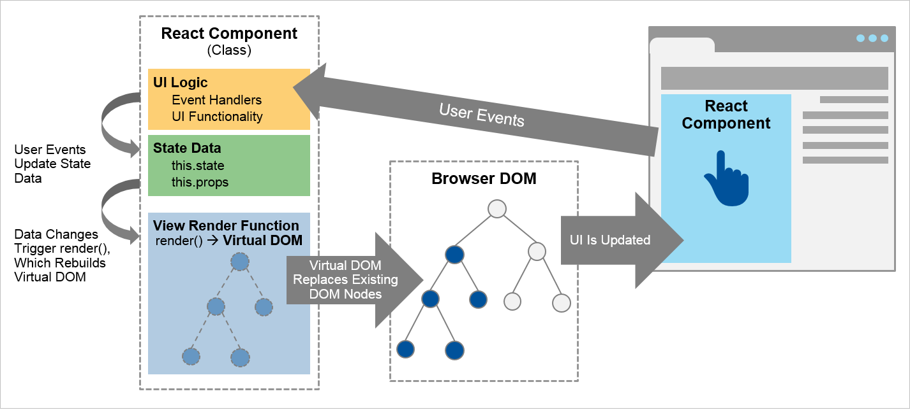

## React


### What is react?
React is an open source JavaScript library/framework developed by Facebook since 2013.

React uses ES6 (ECMAScript 6), ECMAScript was created to standardize JavaScript, and ES6 is the 6th version of ECMAScript, it was published in 2015, and is also known as ECMAScript 2015.

### What is virtual DOM
**DOM** stands for ‘Document Object Model. It is a structured representation of the HTML elements that are present in a webpage or web-app. DOM represents the entire UI of your application. The DOM is represented as a tree data structure. It contains a node for each UI element present in the web document.


## How to create a simple React app?

There are two ways to use React in your web application. The First way is to build a new React app, second is to add React to your current web app/ website no matter it was built by React or not, you can choose which part of your web app to use React as you like!

**Create a new React app:**

**prerequisite**:  node install +  npm install

open **cmd**  run follow command:

```jsx
npx create-react-app [your project name]
cd [your project name]
npm start
//http://localhost:3000
```

### Using TypeScript in React

Go to your existing React project, use command to install typescript

```jsx
npm install --save typescript @types/node @types/react @types/react-dom @types/jest
# or
yarn add typescript @types/node @types/react @types/react-dom @types/jest
```

Next, rename any file to be a TypeScript file (e.g. `src/index.js` to `src/index.tsx`) and **restart your development server**!

### Getting Started with TypeScript and React[](https://create-react-app.dev/docs/adding-typescript/#getting-started-with-typescript-and-react)

You are not required to make a `[tsconfig.json` file](https://www.typescriptlang.org/docs/handbook/tsconfig-json.html), one will be made for you. You are allowed to edit the generated TypeScript configuration.

- [TypeScript Handbook](https://www.typescriptlang.org/)
- [TypeScript Example on React](https://www.typescriptlang.org/play/index.html?jsx=2&esModuleInterop=true&e=196#example/typescript-with-react)
- [React + TypeScript Cheatsheets](https://github.com/typescript-cheatsheets/react-typescript-cheatsheet#reacttypescript-cheatsheets) has a good overview on how to use React with TypeScript

**Create a production build**

**npm run build** creates a build directory with a production build of your app. Inside the build/static directory will be your JavaScript and CSS files.

**Use react by CDN**

react and react-dom are available over a **CDN**. (add react to website )

```jsx
//react
<script crossorigin src="https://unpkg.com/react@17/umd/react.production.min.js"></script>
//react-dom
<script crossorigin src="https://unpkg.com/react-dom@17/umd/react-dom.production.min.js"></script>
```

eg:

```jsx
<!- ... existing HTML ... -->
<div id="root"></div>
<!-- ... existing HTML ... -->

<!-- ... other HTML ... -->
<!-- Load React. -->
<!-- Note: when deploying, replace "development.js" with "production.min.js". -->
<script src="https://unpkg.com/react@17/umd/react.development.js" crossorigin></script>
<script src="https://unpkg.com/react-dom@17/umd/react-dom.development.js" crossorigin></script>

<!-- Load our React component. -->
<script src="react.js"></script>

```

create react.js script like this
```js
// ... the starter code you pasted ...
import App from ...

ReactDOM.render(<App />, document.getElementById('root'));
```

**React playground/online compiler**

[React](https://codesandbox.io/s/new)

