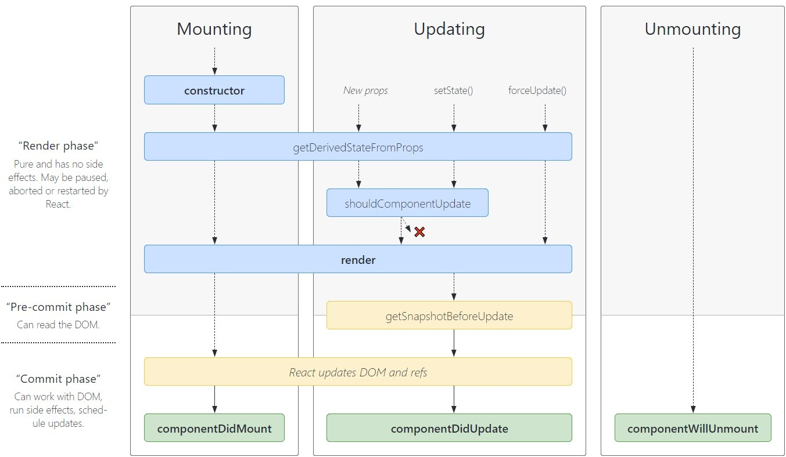

## React lifecycle

### Mounting:

**mounting** means **putting elements** into the **DOM(Document Object Model)**

The main job of React is to figure out how to modify the DOM to match what the components want to be rendered on the screen.

React does so by "**mounting**" (**adding nodes to the DOM**), "**unmounting**" (**removing them from the DOM**), and "**updating**" (**making changes to nodes already in the DOM**).

### What is React Lifecyle method?

- You can think of React lifecycle methods as the series of events that happen from the birth of a React component to its death.
- **componentDidMount()**, **componentDidUpdate()**, **componentWillUnmount()**, these are examples of Lifecyle method.
- Lifecyle method is for class component only, not for function component.
- **Mounting** 👉 birth of your component
- **Update** 👉  growth of your component
- **Unmount** 👉  death of your component

**Mounting** is the initial phase in which the instance of the component is created and inserted into the DOM. When the component gets successfully inserted into the DOM, the component is said to be mounted. In the **updating phase**, the component gets updated while being present in the DOM. In the **unmounting phase**, the component is removed from the DOM.

### Rendering vs Mounting
- "Rendering" is any time a function component gets called (or a class-based render method gets called) which returns a set of instructions for creating DOM.
- "Mounting" is when React "renders" the component for the first time and actually builds the initial DOM from those instructions.

### Reference

[https://programmingwithmosh.com/javascript/react-lifecycle-methods/](https://programmingwithmosh.com/javascript/react-lifecycle-methods/)
